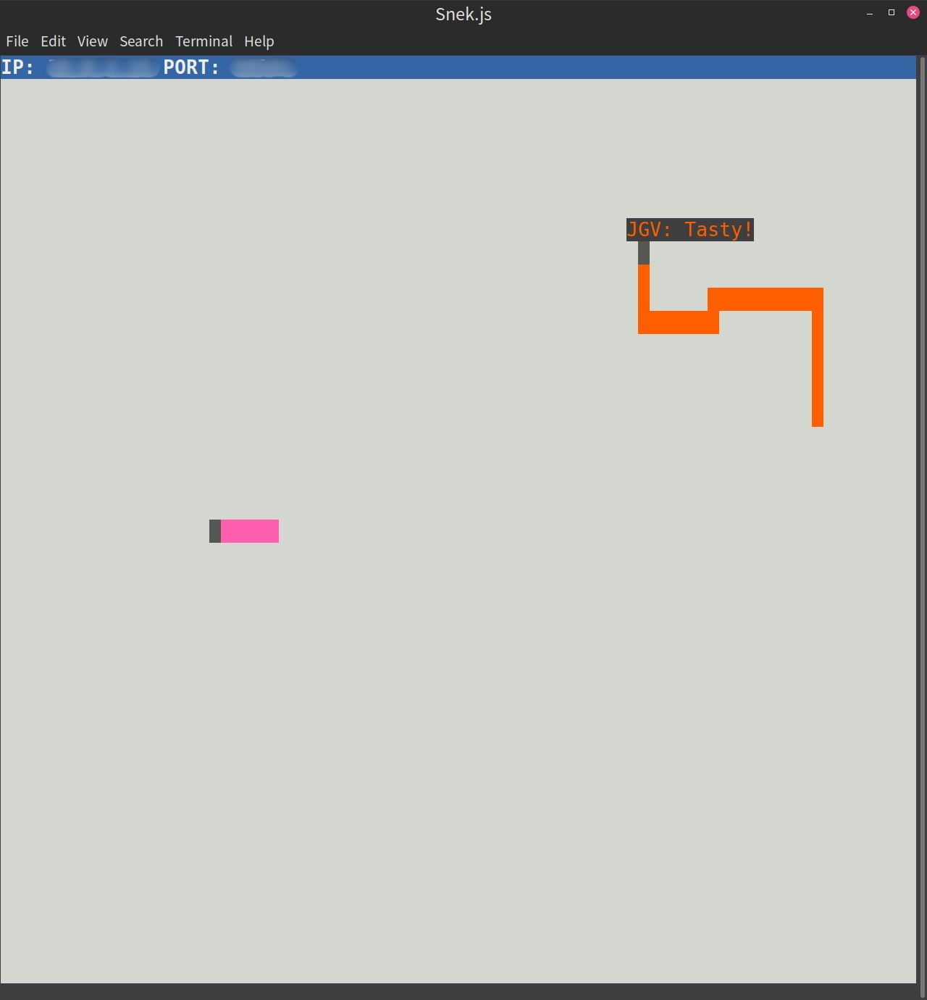

# Snake Client

Snake is a very popular video game genre first started in the 1976 arcade game, [Blockade](https://en.wikipedia.org/wiki/Snake_(video_game_genre)). It is a video game concept where the player manoeuvres a dot and grows it by "eating" pieces of food. As it moves and eats, it grows and the growing snake becomes an obstacle to smooth manoeuvres. The goal is to grow it to become as big as possible without bumping into the side walls, or bumping into itself, upon which it dies (Or, in the multiplayer version, bumping into other snakes).

This is simply a multiplayer take on the genre. This project implements the client portion of the game, and uses a heavily modified version of Tania Rascia's [snek](https://github.com/taniarascia/snek) for the server and GUI code.

## Installing Snake

### Installing `snek-multiplayer`
- Create a `Snake` folder.
- `cd` into this folder and run `git clone https://github.com/lighthouse-labs/snek-multiplayer` to install the server code.
- Now you should have a folder called `snek-multiplayer` inside your `Snake` folder.

### Installing `snake-client`
- Within the `Snake` folder (and right next to `snek-multiplayer`), run this command: `git clone https://github.com/jvarghe/snake-client`.
- This should download and install my implementation of the `snake-client` code on to your computer. Now you should have two folders within `Snake`.

## Configure Snake
- Open a terminal window and cd into `snek-multiplayer`. Run this command: `npm run play`. This should start the GUI window for the game.
- This window should display the local IP and Port at the very top. Write down this information.
- Open the `snake-client` project, and open the `constants.js` file. Replace the `IP` & `PORT` values with values you wrote down.
- Optionally, you can enter your initials (up to 3 characters) for the `initials constant in `client.js`.
- Open a second terminal window and cd into `snake-client`. It's best to have the two terminal windows running side-by-side. Run `snake-client` with the command `node play.js`.
- Be sure to keep the `snake-client` terminal window active so that it registers your key presses. Do NOT pass key presses into `snake-multiplayer` window, because that won't work.

## Playing Snake
- Use the `W`, `A`, `S`, `D` keys to move your snake around (Caps Lock doesn't matter).
- Use the numbers `1`, `2` or `3` to send canned messages to your opponents.
